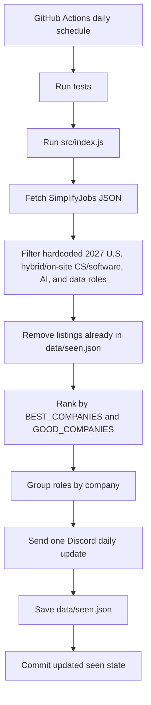

# LawJob Listings

Lowk [vibecoded](https://encrypted-tbn0.gstatic.com/images?q=tbn:ANd9GcQ5jRY7cs5l49H2ciKtpcdGy30kxu4qzY29nw&s) Discord Node.js bot that scrapes SimplifyJobs internship listings and compiles daily 2027 Internship Updates for U.S. CS internships. Made for the five active people in the Chico ACM Discord.

Source repo: [SimplifyJobs/Summer2027-Internships](https://github.com/SimplifyJobs/Summer2027-Internships)

The human-facing boards are [README-Off-Season.md](https://github.com/SimplifyJobs/Summer2027-Internships/blob/dev/README-Off-Season.md) and [README.md](https://github.com/SimplifyJobs/Summer2027-Internships/blob/dev/README.md). The machine source is [listings.json](https://raw.githubusercontent.com/SimplifyJobs/Summer2027-Internships/dev/.github/scripts/listings.json).

## Hardcoded filters

Hardcoded rules in `src/index.js`:

- Source JSON: `DEFAULT_LISTINGS_URL`
- State file: `DEFAULT_STATE_PATH` (`data/seen.json`)
- Target terms: `TARGET_2027_TERMS` (`Winter 2027`, `Spring 2027`, and `Summer 2027`)
- Discord schedule label: `DAILY_POST_TIME_LABEL`
- U.S. location rule: `US_STATE_LOCATION` plus standard `country` values such as `US`, `USA`, `United States`, or `America`
- Remote filter: `isHybridOrOnsiteListing()` rejects locations containing `remote`
- Title keywords: `SOFTWARE_KEYWORDS`
- Priority companies: `BEST_COMPANIES` and `GOOD_COMPANIES`
- Unlisted company limits: `MAX_UNLISTED_WHEN_PRIORITY_IS_HIGH` and `MAX_UNLISTED_WHEN_PRIORITY_IS_LOW`

Note: Everything is hardcoded, so edit `src/index.js` if you want to change the company list, keyword list, target terms, or post cap.

## Posting behavior

- First run is the exception to the normal save rule: it seeds `data/seen.json` without posting, so the channel does not get spammed with old listings.
- Later runs post only listings that are not already in `data/seen.json`.
- Each run sends one daily Discord update titled `Daily 2027 Internship Updates`.
- The message includes the previous-day date range, the `Daily at 3:00 PM PT` label, numbered company sections, and apply links.
- Best companies use 🔥, good companies use ✨, and unlisted "mid" companies have no emoji.
- Multiple roles at the same company are grouped under that company's numbered section.
- Best and good companies are not capped.
- If best + good company posts >= 10, the bot adds up to 5 unlisted company posts.
- Otherwise, the bot adds up to 10 unlisted company posts.
- After the first run, `data/seen.json` is updated only after the daily Discord update posts successfully.

## Sample

## Daily 2027 Internship Updates

**7 new U.S. CS/software internships found today**  
June 21 - June 22  
Daily at 3:00 PM PT

━━━━━━━━━━━━━━━━━━━━

### 1. 🔥 **Google**
Titles:
- Software Engineering Intern — Mountain View, CA — https://example.com/google-swe
- Data Science Intern — San Francisco, CA — https://example.com/google-data

### 2. 🔥 **Apple**
Title: Software Engineering Intern  
Location: Cupertino, CA  
Apply: https://example.com/apple-swe

### 3. ✨ **Datadog**
Title: Software Intern  
Location: New York, NY  
Apply: https://example.com/datadog-software

### 4. **Lovense**
Title: Backend Penetration Testing Intern  
Location: Gary, IN  
Apply: https://example.com/lovense

━━━━━━━━━━━━━━━━━━━━

## Contributing

I'm too lazy to expand the hardcoded `BEST_COMPANIES` and `GOOD_COMPANIES` so once you get hired, please go ahead and add your company to the list if it's not there.

## Setup

Create a Discord webhook for the target channel and store it as a GitHub Actions secret named:

```text
DISCORD_WEBHOOK_URL
```

Install dependencies:

```bash
npm ci
```

## Local commands

Dry run without posting or updating `data/seen.json`:

```bash
npm run dry
```

Run normally:

```bash
npm start
```

Run tests:

```bash
npm test
```

## Structure



## Environment variables

| Name | Default | Notes |
| --- | --- | --- |
| `DISCORD_WEBHOOK_URL` | none | Required unless `DRY_RUN=true` |
| `DRY_RUN` | `false` | Logs matches without posting or updating state |
| `LISTINGS_URL` | SimplifyJobs 2027 listings JSON | Optional local override for testing a different feed |

## GitHub Actions

The workflow in `.github/workflows/check-internships.yml` runs manually or once per day at 3:00 PM PSt (22:17 UTC). It runs tests, checks listings, posts the daily Discord message, and commits `data/seen.json` so duplicate listings aren't posted.
