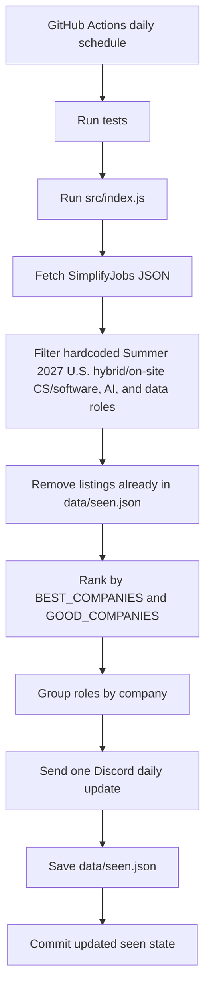

# Internship Discord Notifier

Simple Node.js bot that pulls SimplifyJobs internship listings once per day and posts new Summer 2027 U.S. CS/software, AI, and data internships to Discord through a webhook.

Source repo: [SimplifyJobs/Summer2026-Internships](https://github.com/SimplifyJobs/Summer2026-Internships)

Note: The source is still the Summer 2026 listings JSON until a Summer 2027 repo/feed exists. The bot only keeps listings tagged `Summer 2027`.

## Hardcoded filters

These rules live in `src/index.js`:

- Source JSON: `DEFAULT_LISTINGS_URL`
- Simplify board link: `SIMPLIFY_2027_BOARD_URL`
- State file: `DEFAULT_STATE_PATH` (`data/seen.json`)
- Target term: `SUMMER_2027_TERM`
- Discord schedule label: `DAILY_POST_TIME_LABEL`
- U.S. location rule: `US_STATE_LOCATION` plus `country` values matching `USA` or `America`
- Remote filter: `isHybridOrOnsiteListing()` rejects locations containing `remote`
- Title keywords: `SOFTWARE_KEYWORDS`
- Priority companies: `BEST_COMPANIES` and `GOOD_COMPANIES`
- Unlisted company limits: `MAX_UNLISTED_WHEN_PRIORITY_IS_HIGH` and `MAX_UNLISTED_WHEN_PRIORITY_IS_LOW`

Note: Everything is hardcoded, so edit `src/index.js` if you want to change the company list, keyword list, target term, or post cap.

## Structure



## Posting behavior

- First run seeds `data/seen.json` without posting, so the channel does not get spammed with old listings.
- Later runs post only listings that are not already in `data/seen.json`.
- Each run sends one daily Discord update titled `Daily 2027 Summer Internship Updates`.
- The message includes the previous-day date range, the `Daily at 3:00 PM PT` label, numbered company sections, and apply links.
- Best companies use 🔥, good companies use ✨, and unlisted "mid" companies have no emoji.
- Multiple roles at the same company are grouped under that company's numbered section.
- The end of the message links to the source repo and the Simplify 2027 internship board.
- Best and good companies are not capped.
- If best + good company posts >= 10, the bot adds up to 5 unlisted company posts.
- Otherwise, the bot adds up to 10 unlisted company posts.
- `data/seen.json` is updated only after the daily Discord update posts successfully.

## Setup

Create a Discord webhook for the target channel and store it as a GitHub Actions secret named:

```text
DISCORD_WEBHOOK_URL
```

Install dependencies:

```bash
npm ci
```

## Local commands

Dry run without posting or updating `data/seen.json`:

```bash
npm run dry
```

Run normally:

```bash
npm start
```

Run tests:

```bash
npm test
```

## Environment variables

| Name | Default | Notes |
| --- | --- | --- |
| `DISCORD_WEBHOOK_URL` | none | Required unless `DRY_RUN=true` |
| `DRY_RUN` | `false` | Logs matches without posting or updating state |
| `LISTINGS_URL` | SimplifyJobs Summer 2026 JSON | Optional local override for testing a different feed |

## GitHub Actions

The workflow in `.github/workflows/check-internships.yml` runs manually or once per day at 22:17 UTC, shortly after 3:00 PM Pacific during daylight saving time. It runs tests, checks listings, posts the daily Discord message, and commits `data/seen.json` so duplicate listings are not posted.
